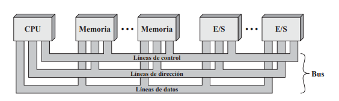
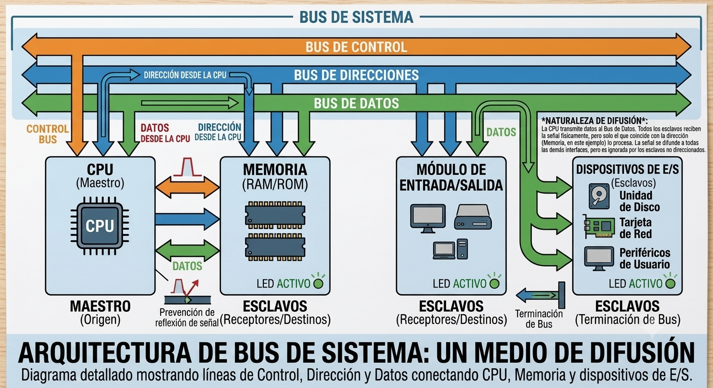

#+options: H:2
#+latex_class: beamer
#+columns: %45ITEM %10BEAMER_env(Env) %10BEAMER_act(Act) %4BEAMER_col(Col) %8BEAMER_opt(Opt)
#+beamer_theme: Madrid
#+beamer_color_theme:
#+beamer_font_theme:
#+beamer_inner_theme:
#+beamer_outer_theme:
#+beamer_header:

#+title: S8 — Buses del Sistema
#+date: 2026-06-18
#+author: G1 - G2
#+email: lenin.falconi@epn.edu.ec
#+language: es
#+select_tags: export
#+exclude_tags: noexport
#+creator: Emacs 27.1 (Org mode 9.3)
#+cite_export: biblatex

#+bibliography: ./bibliography/bibliography.bib
#+LATEX_HEADER: \usepackage[T1]{fontenc}
#+LATEX_HEADER: \usepackage[utf8]{inputenc}
#+LATEX_HEADER: \usepackage[spanish]{babel}
#+LATEX_HEADER: \usepackage[backend=biber,citestyle=apa, style=apa]{biblatex}

* Indicaciones
** Indicaciones
:PROPERTIES:
:BEAMER_opt: allowframebreaks
:END:
- Recuerde que si ~options: H:2~, entonces:
  - ~*~ Declara el nombre de la Sección
  - ~**~ Declara el nombre de la diapositiva
- Puede alterar la estructura de la diapositiva si lo considera necesario
- Reparto del tema por grupos:
  - *G1:* Estructuras de Interconexión, Interconexión punto a punto, QPI
  - *G2:* Interconexión con Buses, Jerarquía de Buses, Elementos de Diseño, PCI Express
- Para este tema consulte las siguientes fuentes:
  - \textcite{stallings2006esp}, 7ma edición, 2006, Español, páginas 99 a 119.
  - \textcite{stallings2022computer}, 11ava edición, 2022, English, páginas 116 a 131.
- Las tuplas (7, 99) significan: Edición 7, página 99 del PDF.
- El grupo expone el tema y sube la presentación (~.ORG~ y ~.PDF~ para Beamer, o ~.ORG~ y ~.HTML~ para reveal.js)
- El grupo sube las ayudas memoria/notas del tema usando la plantilla [[file:FormatoTareas/TemplateNotasClase.org]] (~.ORG~ y ~.PDF~)
** Diseño de las Diapositivas
- Para diseñar sus diapositivas puede consultar cualquiera de las
  presentaciones ~.ORG~ desarrolladas por el profesor así como al
  archivo [[https://github.com/LeninGF/EPN-Lectures/blob/main/iccd332ArqComp-2024-B/Tutoriales/Beamer-Emacs/tutorialBeamer.org][tutorialBeamer.org]] en el repositorio de la clase.
- Recuerde que los archivos ~.ORG~ son archivos de texto así que los
  puede copiar y sustituir por su texto propio.
** Sobre este Documento
- Este documento tiene la propuesta de temas a tratar y desarrollar
  por los estudiantes.
- Se ha de utilizar como base la bibliografía recomendada, pero puede
  consultar bibliografía adicional.
* Buses del Sistema
** Estructuras de Interconexión (7, 97)
* Interconexión con Buses
** Interconexión con Buses (7, 99)
:PROPERTIES:
    :BEAMER_opt: allowframebreaks
    :END:
- Un computador consta de tres componentes fundamentales: *CPU*,
  *Memoria* y *Módulos de E/S*.
- Estos componentes deben comunicarse entre sí para ejecutar
  programas.
- La estructura de interconexión es el conjunto de caminos que
  conectan estos módulos.
- El diseño depende de los intercambios que deban realizarse:
  - *Memoria a CPU*: La CPU lee una instrucción o dato desde la
    memoria.
  - *CPU a Memoria*: La CPU escribe un dato en la memoria.
  - *E/S a CPU*: La CPU lee datos de un dispositivo de E/S mediante el
    módulo correspondiente.
  - *CPU a E/S*: La CPU envía datos o comandos al dispositivo de E/S.
  - *E/S a/desde Memoria*: Utilizado en transferencias directas sin
    pasar constantemente por la CPU (e.g., DMA - Acceso Directo a
    Memoria).
    
    
** Conceptos y Estructura Física
*** ¿Qué es un Bus?
- Un *bus* es un camino de comunicación compartido que conecta dos o
  más dispositivos.
- *Medio de difusión (broadcast)*: Las señales transmitidas por un
  dispositivo son recibidas por todos los demás.
- Si dos dispositivos transmiten al mismo tiempo, sus señales
  colisionarán y se corromperán.
- Por ende, solo *un dispositivo* puede transmitir datos con éxito en
  un instante dado.
- Los buses del sistema modernos constan de decenas de líneas de
  comunicación individuales.
** Estructura del Bus  (7, 99)
:PROPERTIES:
    :BEAMER_opt: allowframebreaks
    :END:
Un bus de sistema se divide en tres grupos funcionales de líneas:

- *Bus de Datos*: 
  - Proporciona un camino para transmitir datos entre los módulos.
  - El número de líneas determina el *ancho del bus de datos* (e.g.,
    32, 64 o 128 bits).
  - El ancho del bus influye directamente en el rendimiento del
    sistema.

- *Bus de Direcciones*:
  - Determina el origen o el destino del dato en el bus de datos.
  - Si la CPU desea leer una palabra de memoria, coloca la dirección
    física de la palabra en estas líneas.
  - El *ancho del bus de direcciones* determina la capacidad máxima de
    memoria direccionable del sistema ($2^{n}$ ubicaciones).

- *Bus de Control*:
  - Controla el acceso y uso de las líneas de datos y direcciones.
  - Transmite órdenes y señales de temporización entre los módulos.
  - *Señales típicas*: Escritura/Lectura de Memoria, Escritura/Lectura
    de E/S, Petición de Bus, Concesión de Bus, Reloj, Reinicio.
    
    
** ¿Por qué surge la Jerarquía de Buses? (7, 102)
:PROPERTIES:
:BEAMER_opt: allowframebreaks
:END:
- Un único bus compartido simplifica la interconexión del sistema.
- A medida que aumenta el número de dispositivos, aparecen limitaciones críticas:
  - *Retardo de propagación:* Las líneas físicas largas ralentizan las señales.
  - *Contención:* Más dispositivos compiten por el acceso al canal.
  - *Tráfico masivo:* El flujo de datos entre CPU, memoria y E/S satura el canal.
- *Resultado:* El bus se convierte en un **cuello de botella** y un único bus ya no puede satisfacer a todos los componentes.

** Jerarquía Tradicional de Buses (7, 102)
*** Arquitectura Clásica                                     
:PROPERTIES:
:BEAMER_col: 0.55
:END:
#+ATTR_LATEX: :width \textwidth
[[./images/JerarquiaTradicionalBus.png]]

*** Características                                           
:PROPERTIES:
:BEAMER_col: 0.45
:END:
- *Bus Local:* Conecta la CPU con la memoria caché a la máxima velocidad del procesador.
- *Bus del Sistema:* Se encarga de conectar la caché con la memoria principal.
- *Bus de Expansión:* Conecta los dispositivos de E/S periféricos.
- *Aislamiento:* Mantiene el tráfico de E/S separado de los procesos de la CPU.

** Jerarquía de Buses de Altas Prestaciones (7, 103)

*** Arquitectura Moderna                                     
:PROPERTIES:
:BEAMER_col: 0.55
:END:
#+ATTR_LATEX: :width \textwidth
[[./images/JerarquiaAltasPrestaciones.png]]

*** Características                                           
:PROPERTIES:
:BEAMER_col: 0.45
:END:
- *Bus de Alta Velocidad:* Conecta de forma más directa los dispositivos exigentes (video, gráficos, redes rápidas).
- *Bus de Expansión:* Mantiene relegados a los dispositivos y periféricos más lentos.
- *Ventaja:* La separación del tráfico mejora el rendimiento global del sistema.
- *Transición:* Esta organización introduce nuevos retos en el arbitraje, la temporización y el ancho del bus.
  
** Elementos de Diseño de un Bus (7, 104)
- El diseño de un bus de sistema no es arbitrario; representa un balance
  crítico entre *costo físico*, *complejidad del hardware* y
  *rendimiento esperado*.
- Para evaluar o diseñar un bus, Stallings define los siguientes parámetros clave:
  - *Físicos*: Tipo de líneas y ancho del bus.
  - *Lógicos y de Control*: Método de arbitraje, tipo de transferencia y temporización.
- A continuación, se analizará cómo cada uno de estos elementos impacta directamente en el ancho de banda del procesador y el direccionamiento del sistema.

* Tipos de Líneas de Bus

* Tipos de Líneas de Bus
** Clasificación por Funcionalidad
*** Líneas Dedicadas vs Multiplexadas
   :PROPERTIES:
   :BEAMER_opt: allowframebreaks
   :END:
- *Dedicadas*:
  - Asignadas permanentemente a una función o subconjunto de
    componentes.
  - Ejemplo: Líneas de direcciones y de datos físicamente separadas.
  - +Rendimiento alto, -Costo de espacio y pines.
- *Multiplexación Temporal*:
  - El mismo conjunto de líneas se usa para diferentes propósitos en
    tiempos distintos.
  - Ejemplo: Las mismas líneas envían la dirección al inicio y luego
    el dato.
  - +Ahorro de espacio y pines, -Lógica de control compleja y
    velocidad.
* Arbitraje del Bus
** Métodos de Control
*** Arbitraje Centralizado vs Distribuido
    :PROPERTIES:
    :BEAMER_opt: allowframebreaks
    :END:
**** Centralizado                                               :Texto:BMCOL:
     :PROPERTIES:
     :BEAMER_col: 0.5
     :END:
- Un solo hardware (*árbitro*) asigna el acceso.
- Proceso: Petición $\rightarrow$ Concesión.
- Punto único de fallo.
**** Distribuido                                               :Imagen:BMCOL:
     :PROPERTIES:
     :BEAMER_col: 0.5
     :END:
- No hay nodo central.
- Cada módulo tiene lógica propia.
- Cooperación mediante protocolos compartidos.

* Temporización
** Coordinación de Eventos
*** Temporización Síncrona
- Determinada por una señal de *reloj del sistema*.
- Todos los dispositivos ven el tren de pulsos (0 y 1).
- Las acciones ocurren en ciclos de reloj fijos.
- *Ventaja*: Simple y rápida de probar.
- *Desventaja*: El dispositivo más lento limita al bus entero.

*** Temporización Asíncrona
- La ocurrencia de un evento depende del éxito del evento anterior.
- Utiliza un protocolo de saludo (*handshaking*).
- $[REQ] \rightarrow [ACK] \rightarrow [Data]$
- *Ventaja*: Mezcla eficiente de dispositivos rápidos y lentos.
- *Desventaja*: Implementación de hardware muy compleja.

* Ancho de Bus y Transferencia
** Parámetros de Rendimiento
*** Ancho del Bus
**** Datos                                                            :BMCOL:
     :PROPERTIES:
     :BEAMER_col: 0.5
     :END:
- Determina cuántos bits se transmiten en paralelo.
- A mayor ancho, mayor rendimiento del sistema.
**** Direcciones                                                      :BMCOL:
     :PROPERTIES:
     :BEAMER_col: 0.5
     :END:
- Determina el rango de memoria direccionable.
- Capacidad máxima: $2^{n}$ bytes.

*** Tipos de Transferencia de Datos
- *Lectura/Escritura*: Operación básica de memoria.
- *Lectura-Modificación-Escritura*: 
  - Operación atómica indivisible.
  - Clave para sincronización y semáforos.
- *Transferencia por Bloques*:
  - Envía 1 dirección y luego una ráfaga de datos.
  - Optimiza el uso de la memoria Caché y DMA.

* Interconexión punto a punto
** Problemas del bus compartido tradicional
[[./images/BusCuelloDeBotella.jpeg]]
-Restricciones eléctricas: Al subir la frecuencia del reloj para ganar velocidad, el bus tradicional falla\\
-El problema: Con tasas de datos tan altas, es casi imposible realizar la sincronización y el arbitraje a tiempo y sin errores\\
** El Reemplazo: Interconexión Punto a Punto
[[./images/InterconexionPuntoaPunto.jpeg]]
-El nuevo estándar: El bus compartido ha sido reemplazado casi por completo por interconexiones punto a punto\\
-Ventajas: Menos latencia, una tasa de datos significativamente más alta y mejor escalabilidad\\
** El Reemplazo: Las 3 características modernas 
[[./images/CapasIPP.jpeg]]
1. Conexiones directas por parejas: Al enlazar directamente dos componentes, se elimina por completo la necesidad de arbitraje
2. Arquitectura de protocolos en capas: Se estructuran de forma similar a las redes de datos (como TCP/IP)
3. Transferencia por paquetes: Los datos se envían como secuencias de paquetes que incluyen cabeceras y detección de errores   
** QPI (11, 120): Ejemplo de Interconexión Punto a Punto: Intel QPI?
# INSTRUCCIÓN: Introducción y motivación del cambio de bus a punto a punto.
- **Interconexión punto a punto** de alta velocidad introducida en 2008 [cite:@stallings2022computer p.118].
- **Motivación:** Superar restricciones eléctricas y latencia de los
  buses compartidos en chips multinúcleo.
- **Pilares:**
  - Conexiones directas por pares (sin arbitraje).
  - Arquitectura de protocolo en capas.
  - Transferencia de datos mediante paquetes con control de errores.

** Configuración Multinúcleo y Red de Conmutación
*** Imagen QPI                                               :Imagen:
:PROPERTIES:
:BEAMER_col: 0.5
:END:
#+ATTR_LATEX: :width 0.9\textwidth
[[./images/MulticoreConfigurationQPI.png]]

*** Explicación                                              :Texto:
:PROPERTIES:
:BEAMER_col: 0.5
:END:
- Los enlaces QPI (flechas verdes) forman una *malla de conmutación* (switching fabric).
- Permite que los datos "salten" entre núcleos para llegar a su destino.
- Conecta el procesador con el I/O Hub (IOH), que traduce señales hacia dispositivos PCIe.
** Configuración Multinúcleo y Red de Conmutación
#+ATTR_LATEX: :width 0.45\textwidth

** Arquitectura de 4 Capas de QPI
#+ATTR_LATEX: :width 0.5\textwidth
[[file:./images/QPILayers.png]]

- **Protocolo:** Reglas de alto nivel y coherencia de caché.
- **Encaminamiento (Routing):** Tablas de ruta definidas por firmware.
- **Enlace (Link):** Transmisión confiable y control de flujo por Flits.
- **Física:** Unidades eléctricas y lógica de bits (Phits).

** Capa Física: Phits y Señalización Diferencial

#+ATTR_LATEX: :width 0.45\textwidth
[[file:./images/PhysicalInterfaceQPIInterconnect.png]]

- **Phit (Physical Unit):** Unidad mínima de 20 bits.
- **Señalización Diferencial (LVDS):** Compara voltajes entre dos cables para reducir ruido.
- **Capacidad:** Hasta 6.4 GT/s (transferencias por segundo), moviendo
  hasta 32 GB/s.
  
** Capa Física: Distribución Multicarril

*** Imagen                                                     :Imagen:
:PROPERTIES:
:BEAMER_col: 0.5
:END:
#+ATTR_LATEX: :width 0.9\textwidth
[[./images/DistribucionMulticarrilQPI.png]]

*** Explicación                                                :Texto:
:PROPERTIES:
:BEAMER_col: 0.5
:END:
- El puerto QPI usa 20 carriles (*lanes*) de datos en cada dirección.
- Los bits de un Flit se reparten entre los carriles usando técnica *round‑robin*.
- Permite la transmisión de un Phit completo (20 bits) en paralelo por ciclo.
  
** Capa de Enlace: Flits y Control de Flujo
- **Flit (Flow Control Unit):** PDU de 80 bits (72 de mensaje + 8 de CRC).
- **Control de errores:** Si el CRC falla, el receptor solicita retransmisión inmediata.
- **Esquema de Créditos:** El receptor devuelve créditos al emisor cuando su buffer tiene espacio, evitando saturación.

** Capas de Encaminamiento y Protocolo
- **Encaminamiento:** Decide el camino del paquete a través de los nodos del sistema usando tablas de rutas.
- **Protocolo:** Maneja la coherencia de caché, asegurando que todos los núcleos vean el dato más actualizado de la memoria.
- **Unidad de mensaje:** El "Paquete", que consiste en un número entero de Flits.

* PCI Express
** PCI Express (11, 123) 
* Referencias
** Bibliografía
:PROPERTIES:
:BEAMER_opt: allowframebreaks
:END:

#+print_bibliography:
